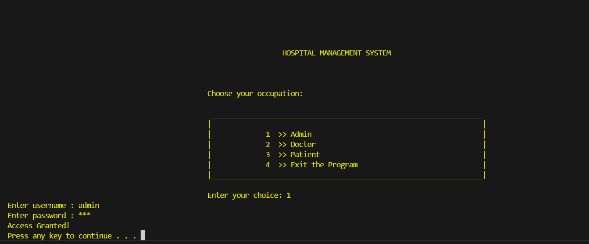
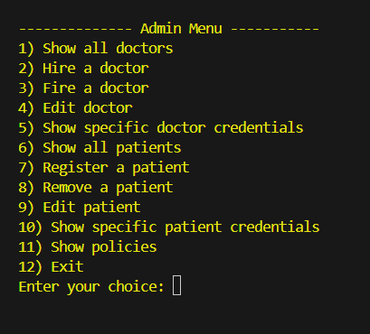
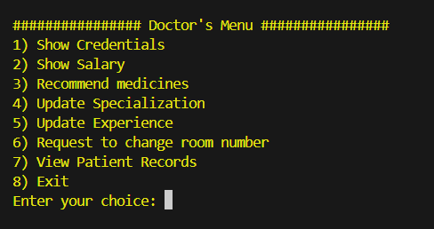
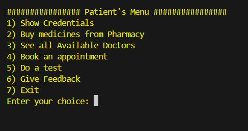
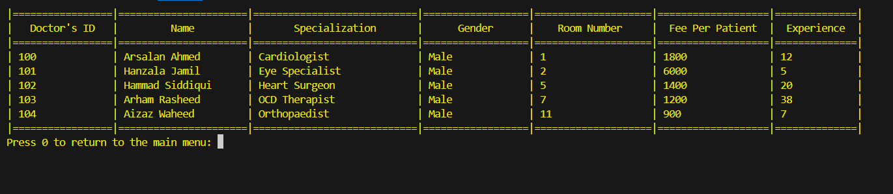
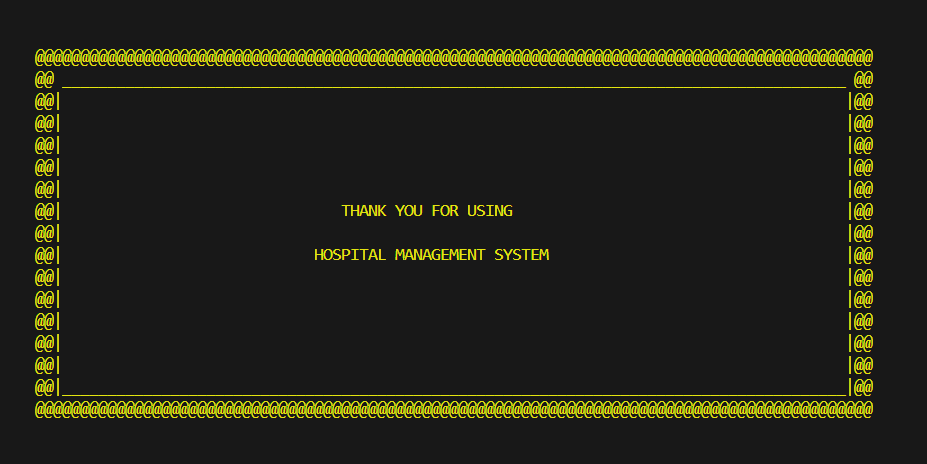

# 🏥 Advanced Hospital Management System (C++ OOP Project)

This is a **Hospital Management System** developed in **C++** as my **second semester Object-Oriented Programming (OOP) project**.  
Unlike basic academic projects, this one demonstrates **advanced C++ concepts** such as **templates, polymorphism, abstraction,file handling, vectors , encapsulation, and modular design**.  
The application is **terminal-based** and provides a structured solution for managing hospital operations with **Admin, Doctor, and Patient panels**.

---

## ✨ Features

### 🔹 Admin Panel
- Add, edit, delete and search doctor/patient records
- Manage all hospital data in a centralized way
- View patient feedback and doctor information

### 🔹 Doctor Panel
- View assigned patients
- Update medical history and treatments
- Access diagnostic reports

### 🔹 Patient Panel
- View personal and medical information
- Access treatment history
- Book appointments and view bills

### 🔹 Other Features
- **Reports & Tests:** Stores diagnostic test data dynamically using templates
- **Feedback System:** Patients can give ratings and feedback
- **Data Persistence:** Uses text files to store all hospital records

---

## 🛠️ Tech Stack
- **Language:** C++
- **Paradigm:** Object-Oriented Programming (Classes, Inheritance, Polymorphism, Templates)
- **Libraries:** `<vector>`, `<fstream>`, `<iomanip>`, `<random>`, `<conio.h>`, `<windows.h>`
- **Platform:** Console/Terminal (Windows)
- **Data Storage:** Plain text files

---
## 📂 How to Run
### 1️⃣ Clone the repository:
   ```bash
   git clone https://github.com/Arsalan692/Hospital-Management-System
   cd Hospital-Management-System
   ```
### 2️⃣ Compile the program:
   ```bash
   g++ Hospital_Management.c -o hospital_mgmt
   ```
### 3️⃣ Run the program:
   ```bash
   ./hospital_mgmt
   ```
---

## 📸 Demo Screenshots
<p align="center">
  
  
  
  
  
  
  
</p>


